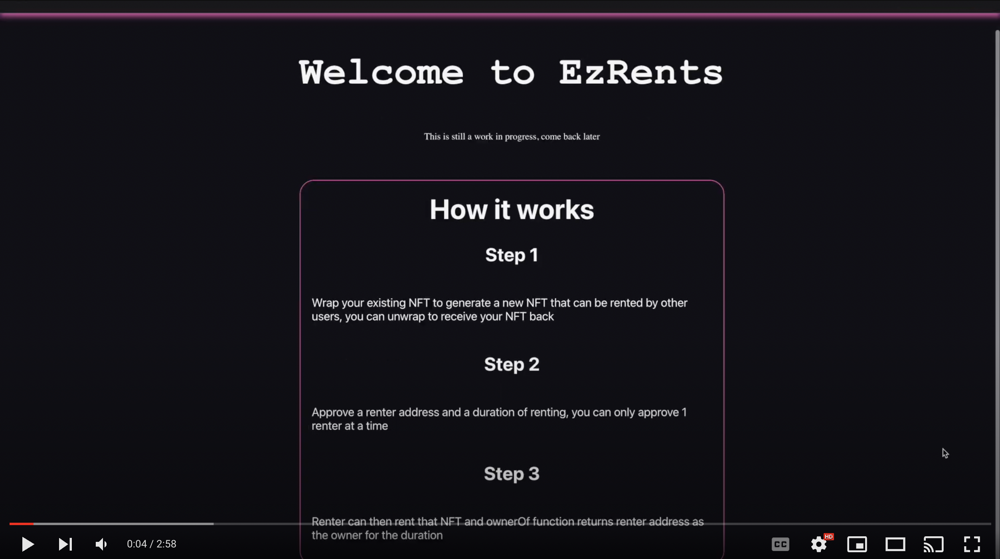
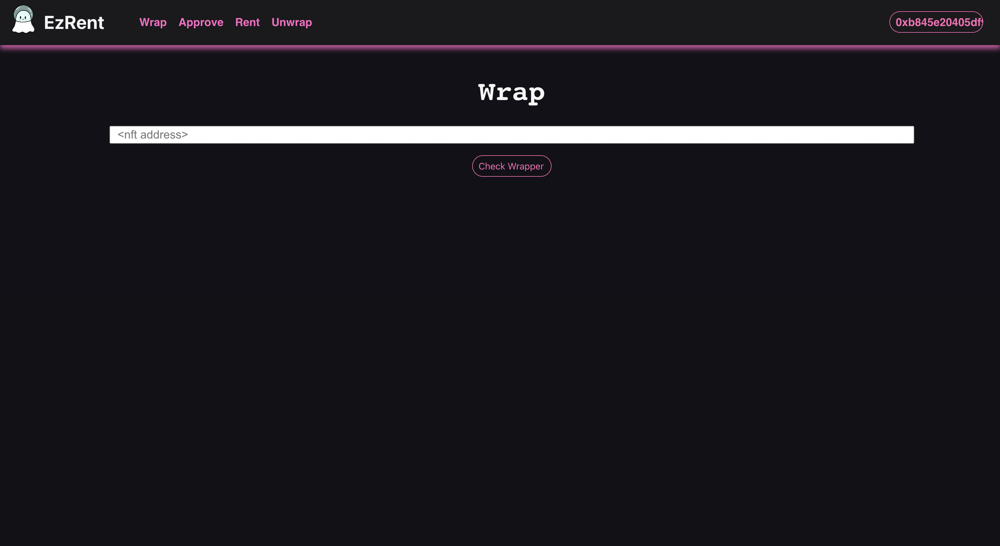
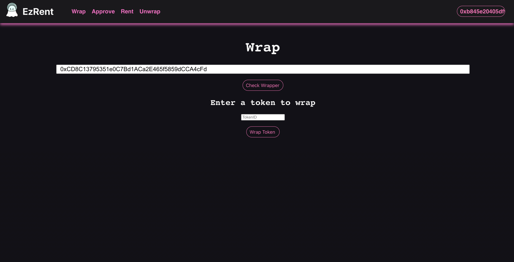
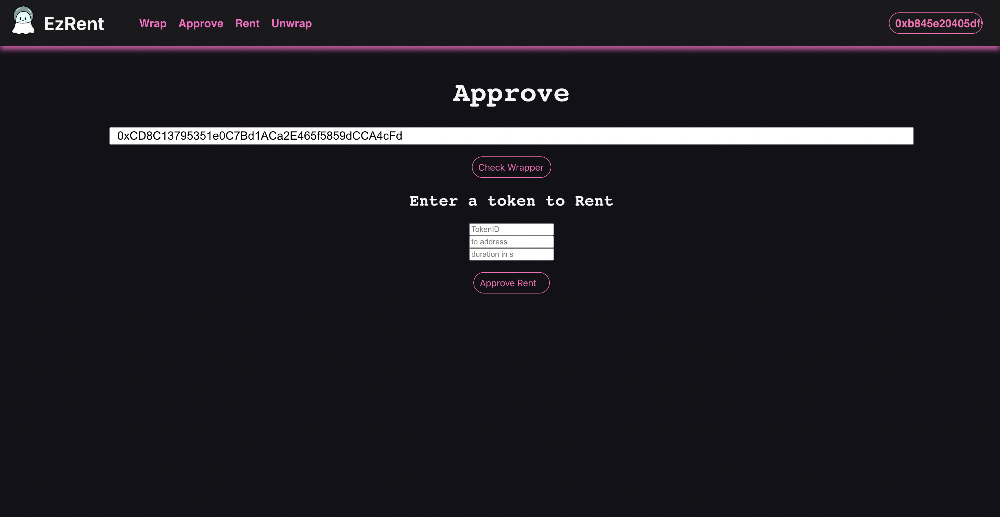

# EzRent

### Demo - click on the image below

Wrapper deployed on mantle testnet: 0xd24Adb84B1E7e3FD97505b6dB2579265ed7D96B8

WrapperFactory deployed on mantle testnet: 0x1281b0F20df286C86ED78F56a6AC24c82EA3De59

Live website: https://nft-rental.onrender.com/

---

## Description

EzRent is an NFT Rental standard and service that allows any NFT contract to we wrapped and converted into a rentable NFT. Users can then approve addresses to rest to and duration and then these addresses can rest the NFTs for the duration, the token ownership switches back automatically after the duration.

TODO: Currently the project relies heavily on OpenZeppelin's implementation but a custom implementation might be way more effective in this case to optimize transfer logic and more.

## Why this is important?

Most users that own an NFT and the ones who actively participate in a GameFi ecosystem are not the same and it makes sense to rent out NFTs under different scenarios to make it actively being used in the ecosystem.

### Screenshots

---

Want to talk about this project ? React out to me on discord: Ace011#5743
